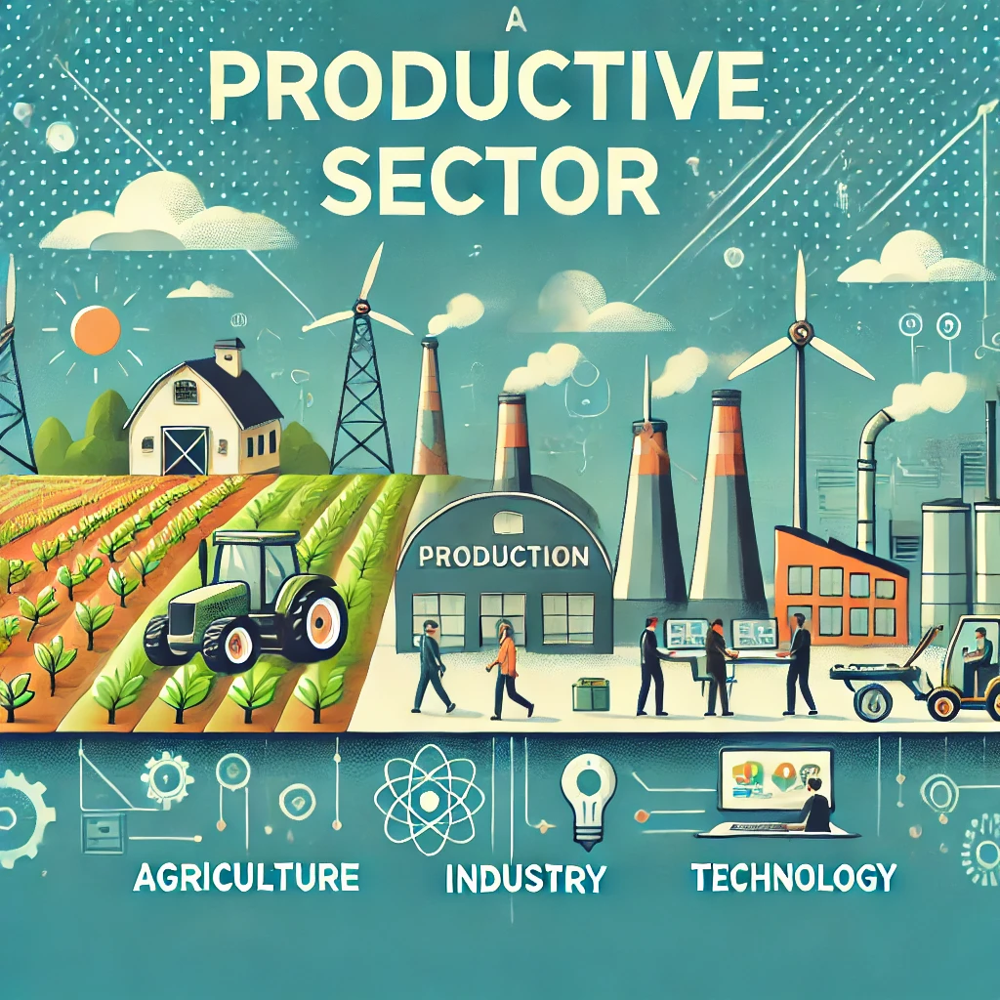

# 📌 Sector Productivo en Informática y Comunicaciones

## 💻 Introducción  

El sector de la informática y las comunicaciones es clave en la transformación digital y en la sostenibilidad, ya que permite optimizar procesos, reducir el consumo de recursos y mejorar la eficiencia en diversas industrias.

## 🌱 Impacto en la Sostenibilidad  

- **Reducción del papel** mediante digitalización.
- **Optimización de procesos** con IA y Big Data.
- **Trabajo remoto**, reduciendo desplazamientos y emisiones de CO₂.

## 📊 Datos Relevantes  

| Factor | Impacto |
|--------|---------|
| Consumo energético de Data Centers | Alto |
| Uso de energías renovables | Creciendo |
| Reciclaje de equipos electrónicos | Mejorable |

## 📌 Conclusión  

El sector TIC es un facilitador clave de la sostenibilidad, pero también enfrenta desafíos como el alto consumo energético de los centros de datos y la obsolescencia tecnológica.

🔗 **Recursos**  
[🌍 ONU sobre Digitalización y Sostenibilidad](https://www.un.org/sustainabledevelopment/es/)

### ⬅️ [Anterior: 1 Aspectos Sostenibilidad ](1_AspectosSostenibilidad_ArroyoGomez.md)

### ➡️ [Siguiente: 1.2 ODS más Relevantes](1.2_ODSRelevantes_ArroyoGomez.md)
