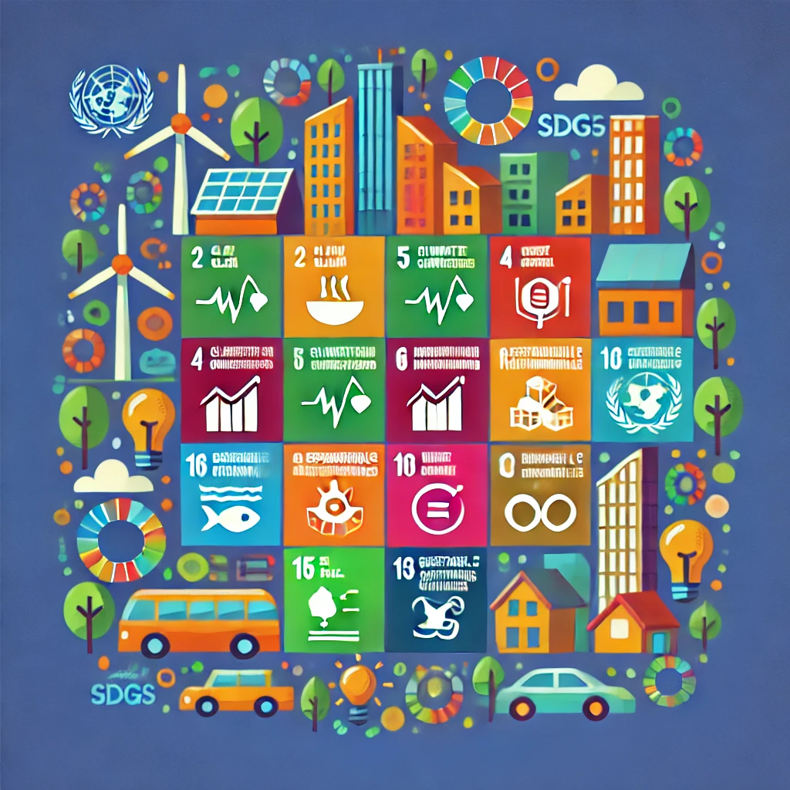

# 🌍 ODS más Relevantes en Nuestro Sector Productivo

## 📌 ¿Qué son los ODS?  
Los **Objetivos de Desarrollo Sostenible (ODS)** son un conjunto de metas globales creadas por la ONU para erradicar la pobreza, proteger el planeta y garantizar la paz y prosperidad.

## 🔍 Selección de los ODS más relevantes  
Para el sector de **informática y comunicaciones**, los ODS más importantes son:

### **📡 ODS 9 - Industria, Innovación e Infraestructura**  
- Promueve el uso de **tecnologías digitales sostenibles**.  
- Fomenta la **investigación y desarrollo (I+D)** en energías limpias y redes eficientes.  

### **⚡ ODS 12 - Producción y Consumo Responsables**  
- Disminuir la **obsolescencia programada**.  
- Reciclar y reutilizar componentes electrónicos.  

### **♻️ ODS 13 - Acción por el Clima**  
- Reducción de la huella de carbono en **centros de datos**.  
- Uso de **energías renovables en la industria tecnológica**.  

## 🎯 Objetivos y Metas Específicas  
1. Aumentar la **eficiencia energética** en los centros de datos.  
2. Impulsar la **digitalización** para reducir el uso de papel.  
3. Fomentar el **reciclaje de dispositivos electrónicos**.  
   
   

📌 **Infografía de los ODS:**  
[🔗 Infografías de la ONU](https://www.un.org/sustainabledevelopment/es/)

---

### 🔗 Navegación  
⬅️ [Anterior:1.1 Nuestro Sector Productivo](1.1_NuestroSectorProductivo_ArroyoGomez.md)  
➡️ [Siguiente: 2. Riesgos y Oportunidades](../2_capitulo2_ra3_pisa3_A_ArroyoGomezMikel/2_RiesgosYOportunidades_ArroyoGomezMikel.md)

