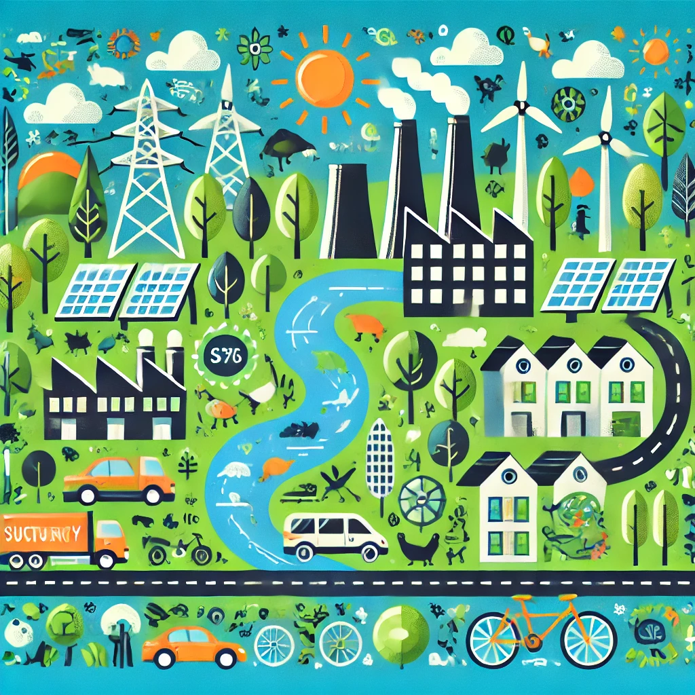

# 🏭 Nuestro Sector Productivo  

## 📌 Introducción  

El sector productivo es el **conjunto de actividades económicas** que generan bienes y servicios esenciales para la sociedad. Estas actividades impactan en tres dimensiones clave:  

- **Económica** 💰: Generación de empleo y crecimiento financiero.  
- **Social** 👥: Calidad de vida y equidad laboral.  
- **Ambiental** 🌱: Uso de recursos naturales y emisiones de CO₂.  

En un mundo cada vez más **digitalizado y globalizado**, la sostenibilidad en el sector productivo es fundamental para garantizar un desarrollo equilibrado y responsable.  

---

## 🌍 Relación con la Sostenibilidad  

📌 **El sector productivo y los Objetivos de Desarrollo Sostenible (ODS)**  
Cada sector de la economía tiene un impacto directo en los **ODS** establecidos por la ONU.  

🔹 **Uso eficiente de los recursos naturales**  

- Implementación de energías renovables y reducción del desperdicio de materiales.  
- Fomento de la economía circular para minimizar la generación de residuos.  

🔹 **Generación de empleo y desarrollo económico**  

- Creación de empleos verdes y mejora de condiciones laborales.  
- Digitalización y automatización para aumentar la productividad de manera sostenible.  

🔹 **Aplicación de tecnologías sostenibles**  

- Desarrollo de infraestructuras ecoeficientes.  
- Uso de Big Data e inteligencia artificial para optimizar procesos industriales.  

---

## 📊 Datos Relevantes por Sector  

Cada sector productivo tiene un impacto diferente en términos ambientales y digitales.  

| **Sector**        | **Impacto Ambiental** | **Nivel de Digitalización** |
|-------------------|----------------------|-----------------------------|
| **Tecnología**    | Medio 🌱             | Alto 💻                     |
| **Industria**     | Alto 🔥              | Medio ⚙️                    |
| **Agricultura**   | Alto 🚜              | Bajo 🌾                     |
| **Comercio**      | Medio 🏪             | Alto 🛒                     |
| **Turismo**       | Alto ✈️              | Medio 🏨                    |

🔹 *Ejemplo:* El sector industrial es uno de los mayores emisores de carbono, pero a su vez, es un área con gran potencial de digitalización para mejorar la eficiencia energética y reducir residuos.  

---

## 🔎 Desafíos y Oportunidades  

📌 **Principales desafíos para la sostenibilidad en el sector productivo:**  

- **Reducción de la huella de carbono** en la fabricación y distribución.  
- **Optimización de los recursos** para minimizar el impacto ambiental.  
- **Creación de modelos de negocio más sostenibles**, basados en el reciclaje y la reutilización.  

📌 **Oportunidades para el crecimiento sostenible:**  
✅ **Automatización verde**: Uso de IA y robótica para mejorar la eficiencia.  
✅ **Inversión en energías limpias**: Uso de paneles solares, eólica y biomasa.  
✅ **Economía circular**: Implementación de estrategias para prolongar la vida útil de los productos.  

---

## 🔗 Recursos  

📘 [Informe de la ONU sobre Sostenibilidad](https://www.un.org/sustainabledevelopment/es/)  
📊 [Tendencias del Sector Productivo y Digitalización](https://www.weforum.org/)  

---

### 🔗 Navegación  

➡️ [Siguiente: Sector Productivo en Informática y Comunicaciones](1.1_NuestroSectorProductivo_ArroyoGomez.md)  
