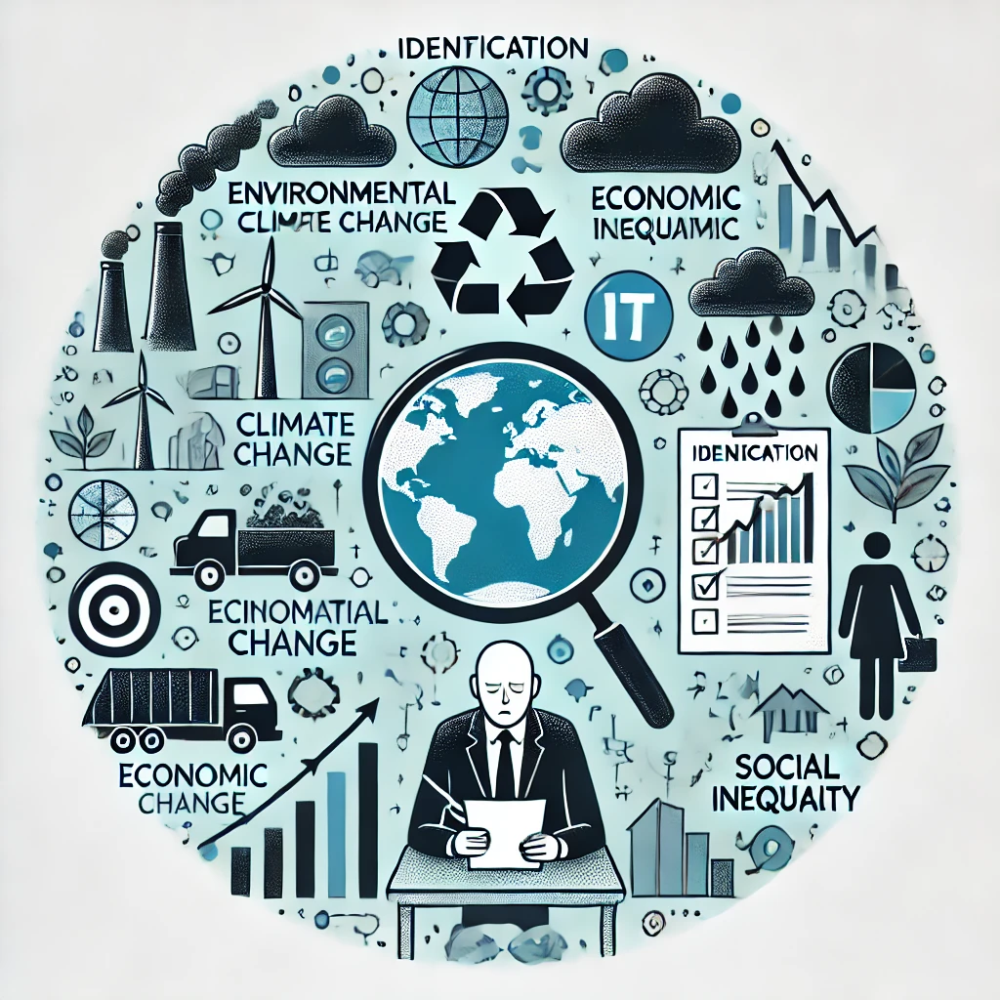

# ⚠️ Identificación de Riesgos en el Sector TIC

## 🔍 Introducción  

El sector de **informática y comunicaciones (TIC)** tiene un fuerte impacto en la sostenibilidad debido a su alto consumo de recursos y generación de residuos electrónicos.  
A continuación, se identifican los principales riesgos **ambientales, sociales y económicos** asociados al sector.

---

## 🌱 1. Riesgos Ambientales  

Los problemas ambientales en el sector TIC están relacionados con la producción, consumo y desecho de dispositivos electrónicos.  
📌 **Principales riesgos:**

- **Alto consumo energético** en servidores y data centers.  
- **Residuos electrónicos (e-waste)** que contaminan el medioambiente.  
- **Extracción de minerales** para la fabricación de hardware (ej. coltán, litio).  

📊 **Impacto Ambiental por Área**  

| Área | Impacto |
|------|---------|
| Data Centers | Alto consumo eléctrico ⚡ |
| Dispositivos | Contaminación por residuos electrónicos ♻️ |
| Producción | Extracción de recursos naturales 🌍 |

## 👥 2. Riesgos Sociales  

El desarrollo del sector TIC también tiene implicaciones sociales importantes.  
📌 **Principales problemas:**

- **Brecha digital** entre países desarrollados y en vías de desarrollo.  
- **Condiciones laborales precarias** en la minería de materiales para dispositivos electrónicos.  
- **Privacidad y seguridad digital**, con riesgos de violaciones de datos.  

---

## 💰 3. Riesgos Económicos  

El sector tecnológico depende de una cadena de producción globalizada y enfrenta riesgos económicos significativos.  
📌 **Principales problemas:**

- **Obsolescencia programada**, que aumenta la compra y desecho de dispositivos.  
- **Escasez de materiales clave** como el silicio y el litio.  
- **Monopolios tecnológicos**, donde pocas empresas dominan el mercado.  

### 🔗 Navegación  

⬅️ [Anterior: 2. Riesgos y OportunidadesSector Productivo en Informática y Comunicaciones](2_RiesgosYOportunidades_ArroyoGomezMikel.md)  
➡️ [Siguiente: 2.2 Oportunidades de Mejora](2.2_OportunidadesDeMejoraEInnovaciónSostenible._ArroyoGomezMikel.md)
