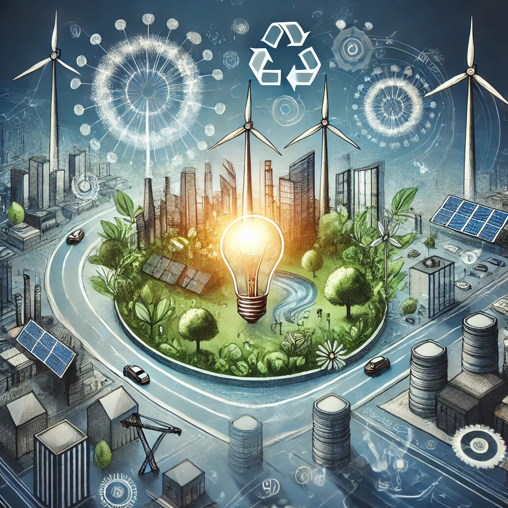

# 🚀 Oportunidades de Mejora e Innovación Sostenible en el Sector TIC  

## 🔍 Introducción  

El sector de **informática y comunicaciones (TIC)** no solo enfrenta riesgos, sino que también ofrece **grandes oportunidades** para la sostenibilidad a través de la innovación y la digitalización.  
A continuación, se presentan estrategias clave para hacer más sostenible este sector.  



## 🔄 2.2.1 Economía Circular como Ventaja Competitiva  

La **economía circular** en el sector TIC busca reducir residuos electrónicos y optimizar el uso de recursos.  

📌 **Estrategias clave:**  

- **Reciclaje y reutilización** de dispositivos electrónicos.  
- **Diseño ecológico** para prolongar la vida útil de los productos.  
- **Reparación y reacondicionamiento** en lugar de reemplazo.  

📊 **Ejemplo de Impacto del Reciclaje Electrónico**  

| Acción | Reducción de CO₂ (%) |
|--------|----------------------|
| Reciclaje de móviles 📱 | 60% |
| Reacondicionamiento de laptops 💻 | 50% |
| Reducción de empaques 📦 | 30% |

---

## 💡 2.2.2 Digitalización y Tecnologías para Mitigar Impactos  

La **transformación digital** juega un papel clave en la reducción del impacto ambiental del sector TIC. A través de la digitalización y el uso eficiente de la tecnología, es posible mejorar la sostenibilidad y reducir la huella ecológica.  

📌 **Beneficios de la Digitalización:**  

- Reducción del **consumo de papel** mediante herramientas digitales.  
- Uso de **energías renovables** en centros de datos y redes.  
- **Optimización de procesos** con inteligencia artificial (IA) y Big Data.  
- Implementación del **teletrabajo**, reduciendo desplazamientos y emisiones de CO₂.  

📊 **Ejemplo de Digitalización y Ahorro de Recursos**  

| Solución Digital | Reducción de Consumo |
|------------------|----------------------|
| Facturación electrónica | -80% papel 📄 |
| Teletrabajo | -40% emisiones 🌍 |
| Nube vs. servidores físicos | -50% energía ⚡ |

### 🔗 Navegación  

⬅️ [Anterior: 2.1 Identificacion de Riesgos Ambientales](2.1_Identificación_de_riesgos_ambientalesSocialesYEconómicos._ArroyoGomezMikel.md)  
➡️ [Siguiente: 3. Retos Ambientales Y Sociales: ](../3_capitulo3_ra3_pisa3_A_ArroyoGomezMikel/3__RetosAmbientalesYsociales_ArroyoGomezMikel.md)
---

📌 **Ejemplo de Código: Optimización Energética en Servidores**  

```python
def optimizar_energia(uso_actual, eficiencia):
    return uso_actual * (1 - eficiencia / 100)

print(optimizar_energia(1000, 40))  # Ahorro del 40%


