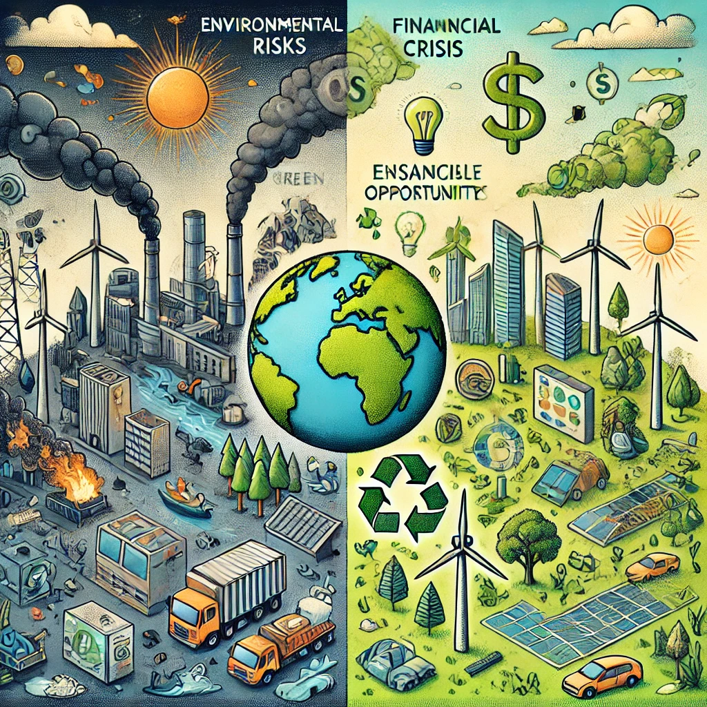

# ⚖️ Riesgos y Oportunidades Asociados a los ODS en el Sector TIC

## 🔍 Introducción  

El sector de **informática y comunicaciones** juega un papel clave en la sostenibilidad.  
Sin embargo, también enfrenta **retos y riesgos ambientales, sociales y económicos**, al mismo tiempo que **ofrece oportunidades para la innovación sostenible**.

En esta sección analizamos los **principales riesgos** y las **oportunidades de mejora** en el sector TIC en relación con los Objetivos de Desarrollo Sostenible (ODS).

## 🏭 Impacto del Sector TIC en la Sostenibilidad  

| Aspecto | Impacto Negativo | Impacto Positivo |
|---------|-----------------|-----------------|
| 🌱 Ambiental | Alto consumo energético en Data Centers | Digitalización reduce uso de papel |
| 👥 Social | Brecha digital en comunidades vulnerables | Acceso a educación y teletrabajo |
| 💰 Económico | Obsolescencia programada y residuos | Crecimiento de la economía circular |

## 📌 **Secciones Clave**

### 🔴 [2.1 Identificación de Riesgos](2.1.md)  

- **Ambientales:** contaminación por residuos electrónicos, alto consumo energético.  
- **Sociales:** brecha digital, condiciones laborales en la industria electrónica.  
- **Económicos:** dependencia de materias primas escasas, alta competencia en el mercado tecnológico.  

### 🟢 [2.2 Oportunidades de Mejora e Innovación](2.2.md)  

- **Economía circular** para reducir residuos electrónicos.  
- **Uso de energías renovables** en centros de datos.  
- **Digitalización** para optimizar procesos y minimizar impacto ambiental.  

### 🔗 Navegación

⬅️ [Anterior: 1.2 ODS Relevantes](../1_capitulo1_ra3_pisa3_A_ArroyoGomezMikel/1.2_ODSRelevantes_ArroyoGomez.md)  
➡️ [Siguiente: 2.1 Identificación de Riesgos Ambientales y Sociales](2.1_Identificación_de_riesgos_ambientalesSocialesYEconómicos._ArroyoGomezMikel.md)
