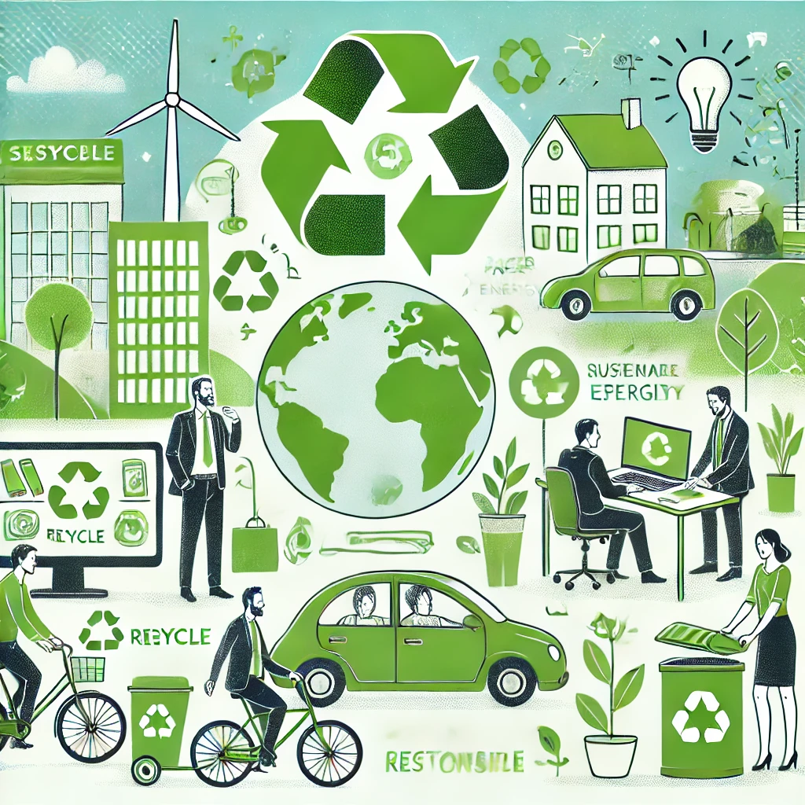

# 🌱 3.1 - Estrategias Personales para la Sostenibilidad  

## 📌 Introducción  

El desarrollo sostenible comienza con **acciones individuales** que, aunque parezcan pequeñas, pueden generar un gran impacto a largo plazo.  
El sector TIC es una pieza clave en la sostenibilidad global, y cada profesional puede contribuir con cambios en sus hábitos diarios.  

> 🌍 *“No podemos cambiar el mundo de la noche a la mañana, pero podemos cambiar nuestros hábitos hoy.”*  

## 🔍 Acciones Clave para Reducir el Impacto Ambiental  

🎯 **1. Uso eficiente de la energía**  

- Apagar los dispositivos cuando no se usen.  
- Configurar el **modo de ahorro de energía** en ordenadores y móviles.  
- Usar **baterías recargables** en lugar de pilas desechables.  

🎯 **2. Reducción del uso de papel**  

- Optar por **facturas electrónicas** y notas digitales.  
- Usar aplicaciones como **Google Drive o Notion** para tomar apuntes.  
- Imprimir solo cuando sea estrictamente necesario.  

🎯 **3. Movilidad sostenible y teletrabajo**  

- Fomentar el **teletrabajo** para reducir la contaminación por desplazamientos.  
- Usar transporte público, bicicleta o vehículos eléctricos.  

🎯 **4. Reciclaje de dispositivos electrónicos**  

- Llevar móviles y ordenadores a **puntos de reciclaje** especializados.  
- Vender o donar equipos que aún sean funcionales.  

## 📊 Beneficios Reales de la Sostenibilidad Personal  

| Acción | Beneficio Ecológico 🌱 | Beneficio Económico 💰 |
|--------|----------------------|----------------------|
| Apagar dispositivos en desuso | Menos consumo eléctrico ⚡ | Reducción en la factura de luz 📉 |
| Uso de documentos digitales | Menos árboles talados 🌳 | Ahorro en papel y tinta 🖨️ |
| Teletrabajo | Menos tráfico y emisiones 🚗💨 | Ahorro en transporte y combustible ⛽ |

🔹 *Ejemplo:* Si cada persona reduce su consumo de energía un 10%, el sector TIC podría ahorrar **millones de kWh al año**.  

### 🔗 Navegación  

⬅️ [Anterior: 3 Retos Ambientales y Sociales](3__RetosAmbientalesYsociales_ArroyoGomezMikel.md)  
➡️ [Siguiente: 3.2 Prácticas Sostenibles en el Ámbito Profesional](3.2_PracticasSosteniblesEnElÁmbitoProfesional_ArroyoGomezMikel.md)  
