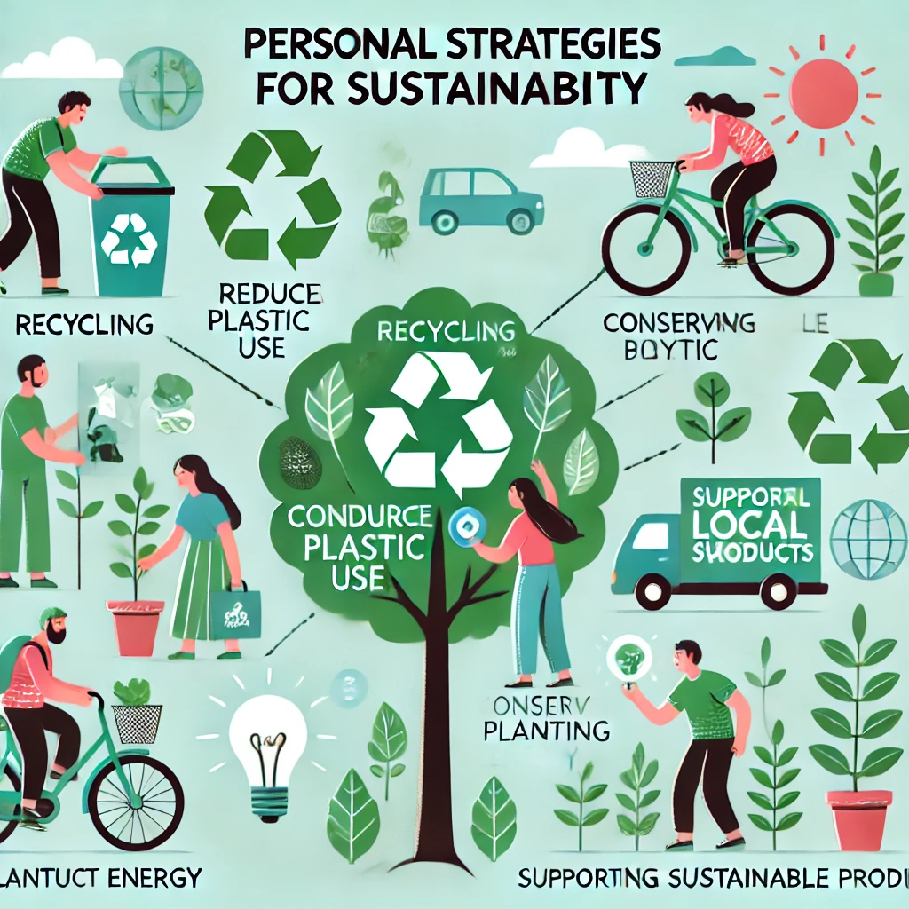

# 🏢 3.2 - Prácticas Sostenibles en el Ámbito Profesional

## 🔍 Introducción  

El compromiso con la sostenibilidad debe extenderse más allá del ámbito personal y aplicarse también en el entorno laboral. Las empresas del sector TIC tienen la responsabilidad de **implementar estrategias sostenibles** en su funcionamiento diario.

## 📌 Estrategias de Sostenibilidad en Empresas TIC  

Las organizaciones pueden reducir su huella ecológica mediante diversas prácticas, como:  

🔹 **Optimización Energética**  

- Implementar **centros de datos eficientes** con energía renovable.  
- Usar **hardware de bajo consumo** y sistemas de refrigeración sostenibles.  

🔹 **Diseño de Productos Sostenibles**  

- Desarrollar dispositivos electrónicos con **materiales reciclables**.  
- Aplicar políticas de **reacondicionamiento** para extender la vida útil de los productos.  

🔹 **Reducción de Residuos y Economía Circular**  

- Fomentar la **reutilización y reciclaje** de equipos informáticos.  
- Disminuir la **obsolescencia programada**, promoviendo actualizaciones de software.  

## 🌍 Beneficios de la Sostenibilidad Empresarial  

| Estrategia | Beneficio |
|------------|----------|
| Energía renovable en servidores | Reducción del 30% en consumo eléctrico ⚡ |
| Reciclaje de equipos electrónicos | Disminución del 50% de residuos electrónicos ♻️ |
| Políticas de teletrabajo | Reducción de emisiones de CO₂ 🚗💨 |

🔹 *Ejemplo:* Empresas como **Google y Microsoft** ya operan con **energía 100% renovable** en sus centros de datos, reduciendo su impacto ambiental.  

### 🔗 Navegación  

⬅️ [Anterior: 3.1 Estrategias Personales para la Sostenibilidad](3.1_EstrategiasPersonalesParaLaSostenibilidad_ArroyoGomezMikel.md)
⬅️ [vuelve al índice](../indice_pisa3_A_ArroyoGomezMikell.md)   
