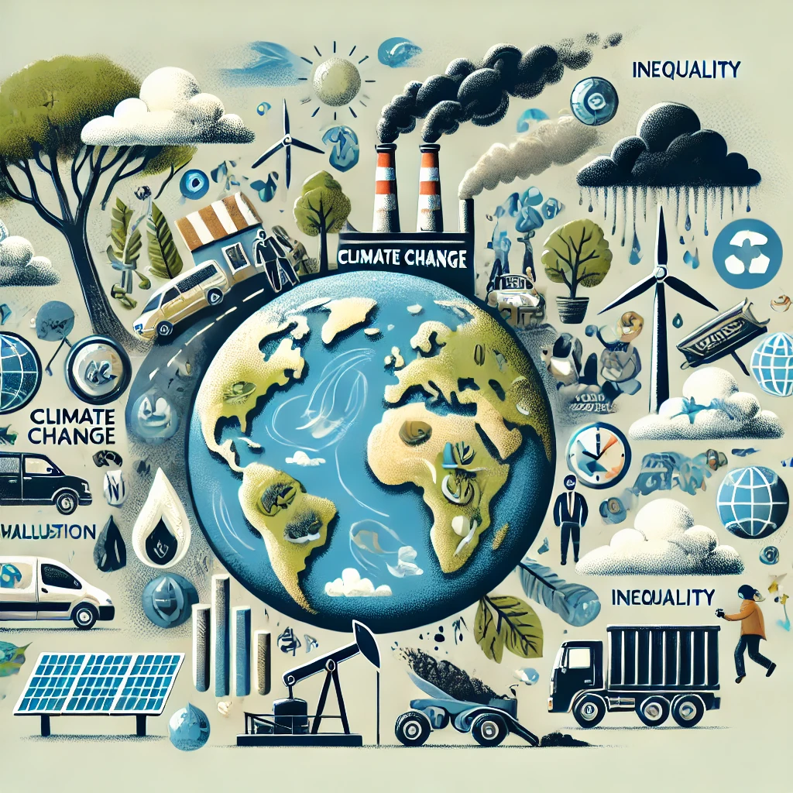

# 🏢 3.Retos ambientales y sociales

## 📌 Introducción  

Las empresas del sector TIC tienen una **gran responsabilidad ambiental y social**. No solo deben innovar tecnológicamente, sino hacerlo de manera **sostenible**.  
Integrar estrategias ecológicas en el ámbito laboral es clave para reducir la huella de carbono y optimizar recursos.  

---

## 🌍 Estrategias Sostenibles en Empresas TIC  

💡 **1. Eficiencia energética en oficinas y centros de datos**  
✔ Uso de energías renovables (solar, eólica).  
✔ Equipos informáticos con certificación de bajo consumo energético.  
✔ Apagado automático de dispositivos fuera del horario laboral.  

💡 **2. Diseño ecológico de productos y economía circular**  
✔ Reducción de materiales contaminantes en hardware.  
✔ Desarrollo de software optimizado para reducir el consumo de CPU y batería.  
✔ Programas de reacondicionamiento y reventa de dispositivos usados.  

💡 **3. Digitalización y reducción del uso de recursos físicos**  
✔ Migración a la nube para evitar servidores físicos innecesarios.  
✔ Reuniones virtuales en lugar de viajes corporativos.  
✔ Implementación de documentos y firmas digitales.  

💡 **4. Responsabilidad Social y Trabajo Ético**  
✔ Fabricación responsable de hardware sin explotación infantil.  
✔ Reducción de la brecha digital con programas de inclusión.  
✔ Políticas de bienestar laboral y flexibilidad horaria.  

## 📊 Impacto de la Sostenibilidad en Empresas TIC  

📉 **Reducción de costos**: Menos gasto en electricidad y materiales.  
♻ **Menos residuos electrónicos**: Reutilización de componentes.  
⚡ **Mayor eficiencia**: Equipos optimizados para menor consumo energético.  
💼 **Mejor reputación**: Empresas sostenibles atraen más clientes y talento.  

> 🌱 *"Las empresas que invierten en sostenibilidad hoy serán las líderes del mañana."*  

---

### 🔗 Navegación  

⬅️ [Anterior: 2.2 Oportunidades de mejore e innovación](../2_capitulo2_ra3_pisa3_A_ArroyoGomezMikel/2.2_OportunidadesDeMejoraEInnovaciónSostenible._ArroyoGomezMikel.md)  
➡️ [Siguiente: 3.1 Estrategias Personales para la sostenibilidad](3.1_EstrategiasPersonalesParaLaSostenibilidad_ArroyoGomezMikel.md)
