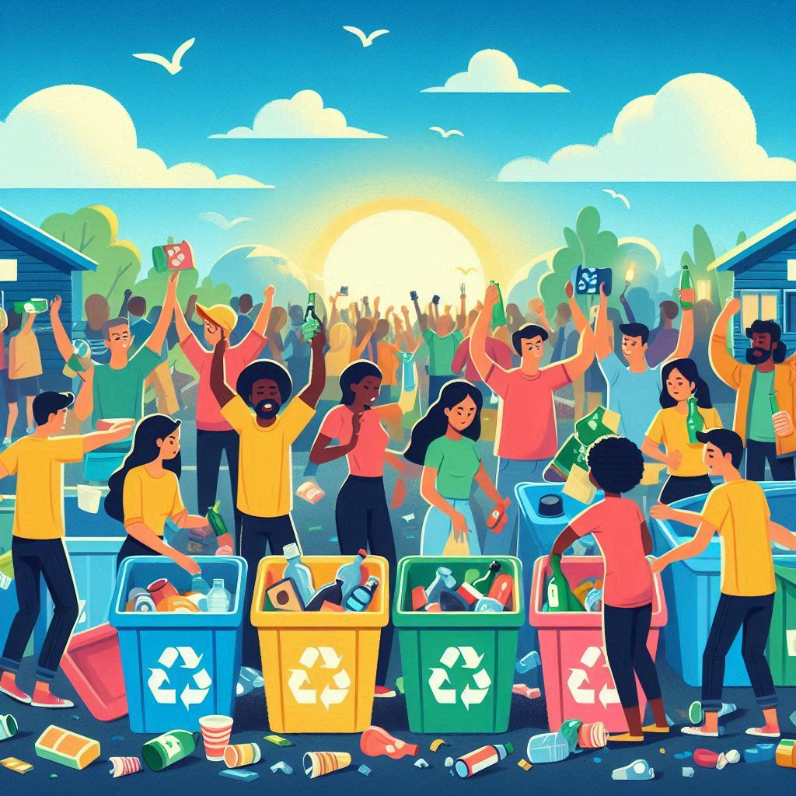

# Modelo Lineal: "Extraer, Producir, Usar y Tirar"

El modelo lineal de producción y consumo es un sistema tradicional que sigue una secuencia lógica de actividades:

1. **Extraer**: Obtención de materias primas del entorno natural.
2. **Producir**: Transformación de esas materias primas en productos manufacturados.
3. **Usar**: Consumo de esos productos por parte de los usuarios.
4. **Tirar**: Descarte de los productos una vez que han cumplido su ciclo de vida [^1].

---

## Extraer

El primer paso en el modelo lineal es la extracción de recursos naturales. Este proceso puede incluir actividades como la minería, la tala de árboles, y la extracción de petróleo y gas.

> "La extracción de recursos es una de las principales causas de la degradación ambiental y la pérdida de biodiversidad."

**Impacto Ambiental**:

- Destrucción de hábitats naturales.
- Contaminación del suelo, agua y aire.
- Emisión de gases de efecto invernadero.

---

## Producir

La producción implica la transformación de materias primas en productos terminados mediante procesos industriales.

**Características**:

- Alta demanda de energía.
- Generación de residuos y subproductos.
- Uso de productos químicos.

**Tipos de Producción**:

1. **Producción en masa**: Fabricación de grandes cantidades de productos.
2. **Producción artesanal**: Fabricación de productos en pequeñas cantidades con un enfoque más personalizado.

---

## Usar

Los productos fabricados se distribuyen a los consumidores para su uso.

**Aspectos Claves**:

- Durabilidad del producto.
- Modo de uso y mantenimiento.
- Percepción del consumidor.

---

## Tirar

Finalmente, cuando los productos ya no son útiles, se desechan.

**Opciones de Descarte**:

- **Vertederos**: Lugares donde se depositan residuos.🗑️
- **Incineración**: Quema de residuos para reducir su volumen.🔥
- **Reciclaje**: Proceso de convertir residuos en nuevos materiales utilizables.♻️

---

## Conclusiones

El modelo lineal de "extraer, producir, usar y tirar" tiene serias implicaciones ambientales y económicas. La dependencia de recursos no renovables y la generación de grandes cantidades de residuos hacen que este modelo sea insostenible a largo plazo.

[^1]: Este modelo lineal se considera obsoleto debido a sus limitaciones para gestionar eficientemente los recursos naturales y su impacto ambiental. Una transición hacia modelos circulares es cada vez más necesaria.
