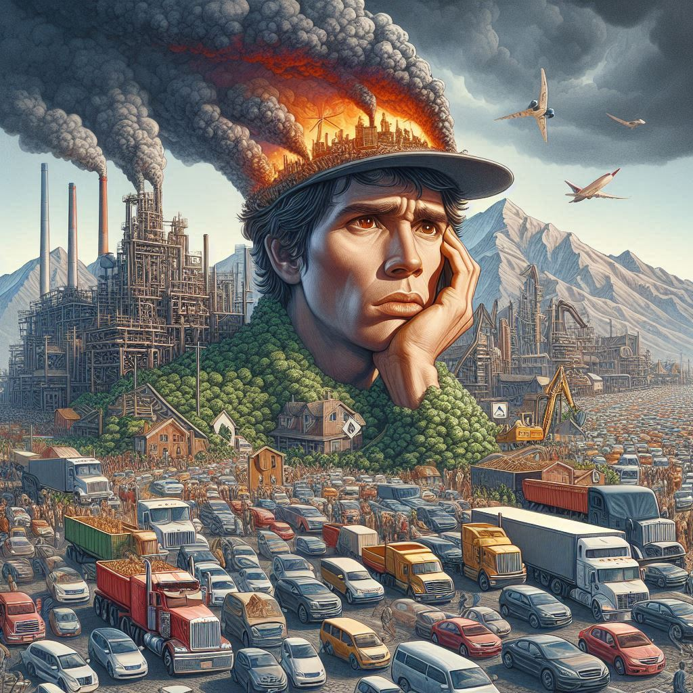
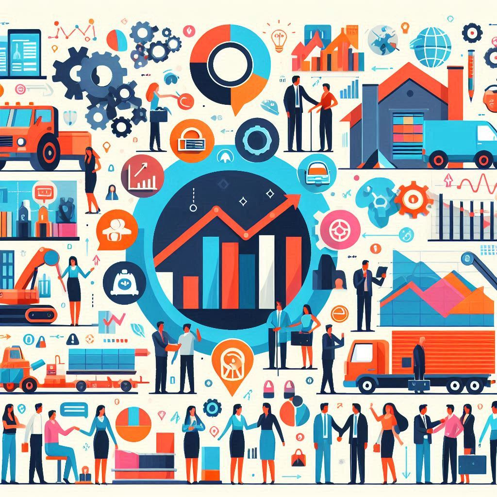

# Problemáticas Asociadas al Modelo Actual: Agotamiento de Recursos y Sobrecapacidad

El modelo lineal de producción y consumo ha llevado a varias problemáticas significativas que afectan tanto al medio ambiente como a la economía global. Entre las más preocupantes se encuentran el agotamiento de recursos y la sobrecapacidad.

---

## Agotamiento de Recursos 🌍

El **agotamiento de recursos** se refiere al uso excesivo y no sostenible de los recursos naturales, que lleva a su eventual desaparición. Este problema es particularmente grave en el contexto del modelo lineal, donde los recursos se extraen, usan y luego se desechan sin consideración por la regeneración.

>"El agotamiento de los recursos naturales es una de las mayores amenazas para la sostenibilidad global."

**Impactos del Agotamiento de Recursos**:

- **Destrucción de Ecosistemas**: La extracción de recursos naturales puede llevar a la deforestación, la pérdida de biodiversidad y la destrucción de hábitats naturales.
- **Cambio Climático**: La explotación de recursos como el petróleo y el gas natural contribuye significativamente a las emisiones de gases de efecto invernadero.
- **Escasez de Recursos**: La sobreexplotación de recursos como el agua dulce y los minerales puede llevar a su escasez, afectando la disponibilidad futura.

---

## Sobrecapacidad ⚙️

La **sobrecapacidad** se refiere a la producción de bienes y servicios en una cantidad que excede la demanda real del mercado. Esto puede llevar a una serie de problemas económicos y ambientales.

**Causas de la Sobrecapacidad**:

- **Sobreproducción**: Las empresas producen más de lo que el mercado puede absorber, buscando maximizar las ganancias a corto plazo.
- **Falta de Planificación**: La falta de planificación a largo plazo y la presión por competir en el mercado puede llevar a decisiones de producción ineficientes.
- **Consumo Irresponsable**: La cultura de consumo y la obsolescencia programada fomentan la compra de nuevos productos, aunque los antiguos aún sean funcionales.

**Consecuencias de la Sobrecapacidad** :

- **Residuos Industriales**: La producción excesiva genera una gran cantidad de residuos que terminan en vertederos o son incinerados.
- **Degradación Ambiental**: La sobreproducción y el consumo excesivo agotan los recursos naturales y dañan el medio ambiente.
- **Inestabilidad Económica**: La sobrecapacidad puede llevar a la caída de precios y a la quiebra de empresas, afectando la estabilidad económica.

---

## Conclusiones

Las problemáticas del agotamiento de recursos y la sobrecapacidad evidencian la necesidad de un cambio en el modelo de producción y consumo. La transición hacia una economía circular, donde los recursos se reutilizan y reciclan, es esencial para asegurar la sostenibilidad a largo plazo.

---
