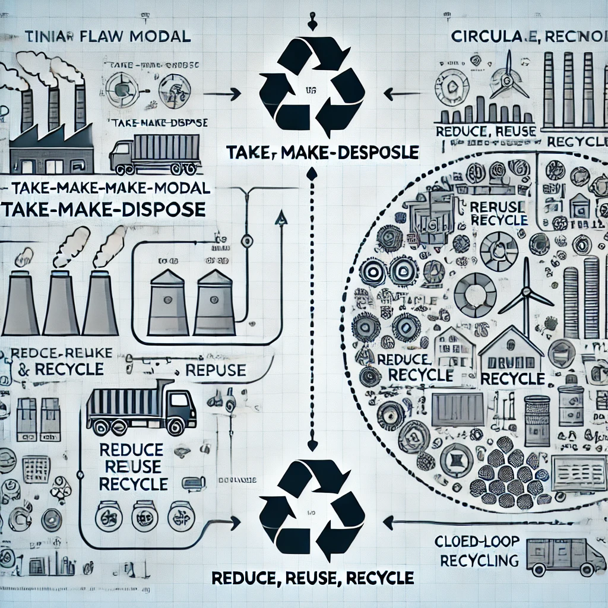

# Modelo de Producción y Consumo Actual

El modelo de producción y consumo actual se caracteriza por su enfoque **lineal**, que sigue un patrón de **extraer, producir, consumir y desechar**. Este enfoque tiene importantes implicaciones para la sostenibilidad y el medio ambiente[^1].

---

## Principales Características

### 1. Producción Lineal

- Alta dependencia de los **recursos naturales no renovables**.
- Uso intensivo de energía y recursos para fabricar productos.
- Generación de residuos y contaminación durante el proceso productivo.

[Producción Lineal vs Economía Circular - Naeco](https://naeco.com/es/actualidad/economia-lineal-vs-economia-circular/#:~:text=Mientras%20que%20la%20econom%C3%ADa%20lineal,reutilizar%2C%20reciclar%20y%20regenerar%22.)

### 2. Consumo Masivo

- Crecimiento exponencial del consumo impulsado por estrategias de **obsolescencia programada**.
- Aumento de los desechos generados debido al consumo desechable.
- Desigualdades en el acceso a bienes y servicios entre regiones del mundo.

### 3. Impactos Negativos

- **Degradación ambiental**: Pérdida de biodiversidad, deforestación, contaminación del aire y el agua.
- **Cambio climático**: Alta emisión de gases de efecto invernadero (GEI) debido a prácticas no sostenibles.
- **Agotamiento de recursos**: Sobreexplotación de recursos finitos como combustibles fósiles y minerales.

> "El modelo económico actual no tiene en cuenta los límites planetarios. Es imperativo transitar hacia un modelo más sostenible y equitativo." *Informe de Sostenibilidad Global 2023*

---

## Alternativas Sostenibles al Modelo Actual

1. **Economía Circular**  
   - Prolongar la vida útil de los productos.  
   - Reciclaje y reutilización de materiales.  
   - Diseño de productos basados en la sostenibilidad.

2. **Producción Responsable**  
   - Implementar energías renovables en los procesos productivos.  
   - Reducir la huella de carbono y los residuos generados.  

3. **Consumo Consciente**  
   - Fomentar el consumo de productos locales y ecológicos.  
   - Educar sobre la importancia de reducir, reutilizar y reciclar.

---

## Datos en Cifras

| Aspecto               | Modelo Lineal            | Economía Circular         |
|-----------------------|--------------------------|---------------------------|
| Recursos utilizados   | No renovables           | Renovables y reciclados   |
| Residuos generados    | Altos                   | Mínimos                   |
| Impacto ambiental     | Elevado                 | Reducido                  |

---

## Conclusión

El modelo actual de producción y consumo no es sostenible en el tiempo. Es fundamental adoptar **modelos alternativos** como la economía circular para garantizar un futuro en equilibrio con los recursos naturales del planeta. 🌍

[^1]: Un modelo lineal no considera el impacto a largo plazo en los recursos naturales, lo que genera problemas de sostenibilidad y degradación ambiental.
