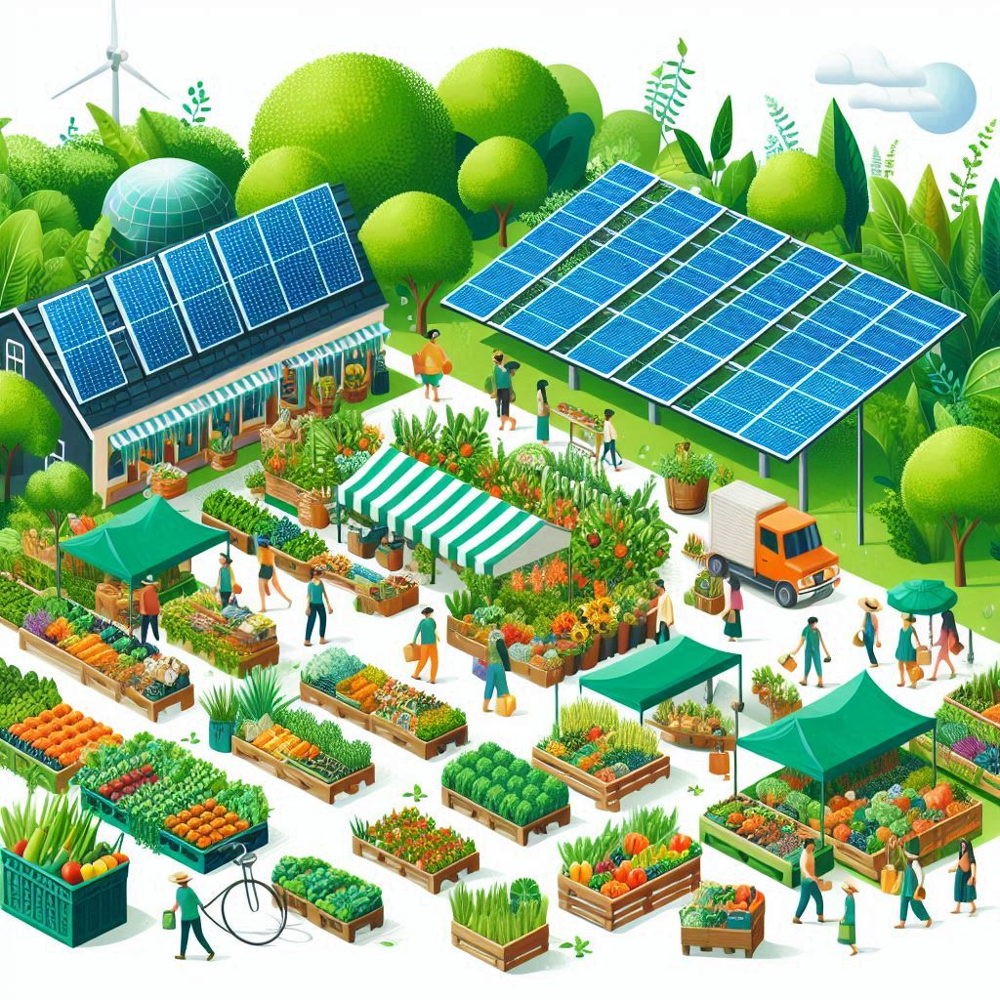
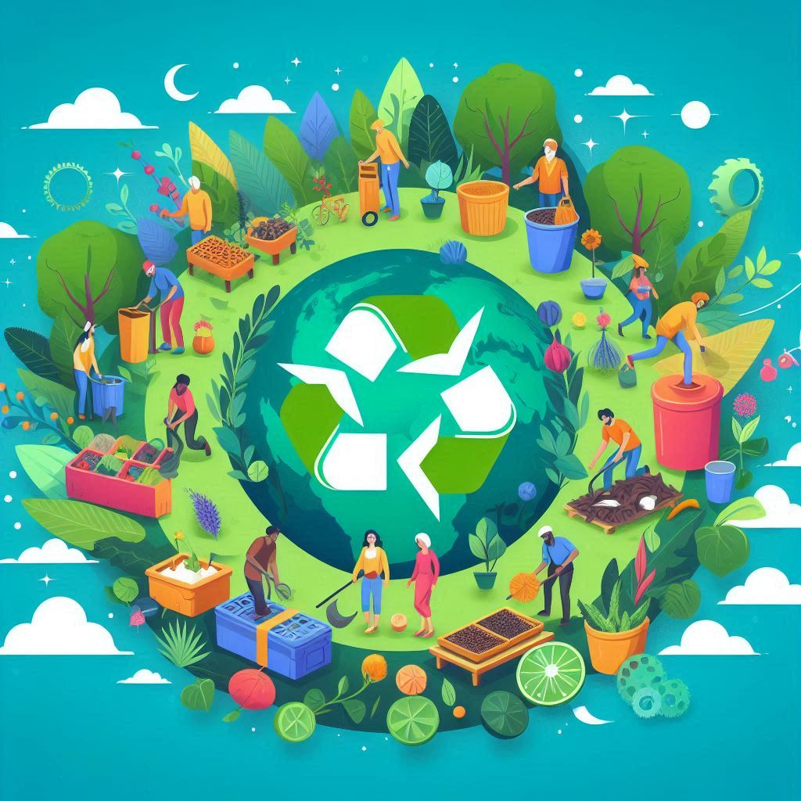

# Beneficios de la Economía Verde y Circular frente al Modelo Clásico de Producción

La transición hacia una economía verde y circular ofrece numerosos beneficios en comparación con el modelo clásico de producción lineal. Este cambio es crucial para alcanzar la sostenibilidad a largo plazo y enfrentar los desafíos ambientales, económicos y sociales que enfrenta el mundo hoy en día.

---

## Economía Verde 🌱

La economía verde se centra en reducir el impacto ambiental de las actividades económicas mientras se promueve el crecimiento y el desarrollo sostenible. Esto incluye prácticas como el uso eficiente de los recursos, la reducción de emisiones de carbono y la protección de la biodiversidad.

### Beneficios de la Economía Verde

- **Reducción de Emisiones**: Implementar tecnologías limpias y eficientes reduce significativamente las emisiones de gases de efecto invernadero.
- **Ahorro de Energía**: Promover el uso de fuentes de energía renovable y mejorar la eficiencia energética.
- **Conservación de la Biodiversidad**: Protege los ecosistemas y las especies, garantizando la salud de la biodiversidad.
- **Creación de Empleos Verdes**: Fomenta nuevas oportunidades de empleo en sectores sostenibles como la energía renovable y la gestión de residuos.

>"La economía verde no solo protege el medio ambiente, sino que también impulsa la innovación y la creación de empleo."

---

## Economía Circular ♻️

La economía circular se basa en el principio de cerrar el ciclo de vida de los productos mediante su reutilización, reparación y reciclaje. En lugar de seguir el modelo lineal de "extraer, producir, usar y tirar", la economía circular busca mantener los recursos en uso durante el mayor tiempo posible.

### Beneficios de la Economía Circular

- **Reducción de Residuos**: Minimiza la generación de residuos mediante el reciclaje y la reutilización de materiales.
- **Eficiencia de Recursos**: Utiliza los recursos de manera más eficiente, reduciendo la dependencia de materias primas nuevas.
- **Innovación en Diseño**: Fomenta la creación de productos diseñados para ser más duraderos, reparables y reciclables.
- **Resiliencia Económica**: Reduce la vulnerabilidad a la escasez de recursos y fluctuaciones de precios, fomentando una economía más estable y resiliente.

>"La economía circular es clave para construir un futuro sostenible, donde los productos son diseñados para durar y los recursos son utilizados de manera eficiente."

---

## Beneficios Económicos, Sociales y Ambientales

### Beneficios Económicos

- **Ahorros en Costes**: La eficiencia en el uso de recursos y la reducción de residuos pueden generar importantes ahorros económicos.
- **Nuevas Oportunidades de Negocio**: La innovación en tecnologías limpias y reciclaje puede abrir nuevas oportunidades de mercado.
- **Empleo Sostenible**: Creación de empleos en sectores verdes y circulares, mejorando la estabilidad económica.

### Beneficios Sociales

- **Mejora de la Salud Pública**: La reducción de emisiones y contaminantes mejora la calidad del aire y la salud de las personas.
- **Calidad de Vida**: La conservación del medio ambiente y el uso sostenible de los recursos contribuyen a un entorno de vida más saludable.
- **Equidad Social**: Acceso a recursos y oportunidades de empleo en comunidades que tradicionalmente han sido desfavorecidas.

### Beneficios Ambientales

- **Reducción de Emisiones**: Menores emisiones de gases de efecto invernadero gracias a la eficiencia energética y el uso de energías renovables.
- **Conservación de Recursos**: Uso más eficiente y sostenible de los recursos naturales, reduciendo la presión sobre el medio ambiente.
- **Protección de Ecosistemas**: Conservación de la biodiversidad y los hábitats naturales, promoviendo un equilibrio ecológico.

---

## Comparación con el Modelo Clásico de Producción

El modelo clásico de producción, basado en "extraer, producir, usar y tirar", tiene numerosas desventajas que afectan negativamente al medio ambiente y a la economía. La economía verde y circular ofrecen soluciones más sostenibles y beneficiosas a largo plazo.

| Característica             | Modelo Clásico de Producción         | Economía Verde                         | Economía Circular                      |
|----------------------------|--------------------------------------|----------------------------------------|----------------------------------------|
| Uso de Recursos            | Extracción intensiva                 | Uso eficiente y renovable              | Reutilización y reciclaje               |
| Emisiones                  | Altas emisiones de carbono           | Reducción de emisiones                 | Minimización de residuos                |
| Residuos                   | Alta generación de residuos          | Gestión sostenible                     | Reducción y reutilización               |
| Innovación                 | Basado en la producción en masa      | Tecnologías limpias y eficientes       | Diseño para la durabilidad y reciclaje  |
| Empleo                     | Empleo tradicional                   | Creación de empleos verdes             | Nuevas oportunidades en reciclaje       |

---

## Conclusiones

La adopción de una economía verde y circular frente al modelo clásico de producción es esencial para asegurar la sostenibilidad y la salud del planeta. Los beneficios ambientales, económicos y sociales de estas economías son significativos y ofrecen un camino hacia un futuro más justo y equilibrado.

---
