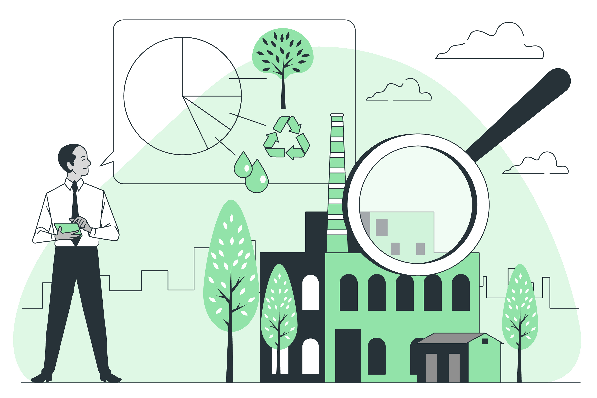

## 7.2 Ejemplos de Ecodiseño Aplicados a Sectores Específicos

El **ecodiseño** se ha implementado en diversas industrias con el objetivo de reducir el impacto ambiental y mejorar la sostenibilidad de los productos. A continuación, se presentan algunos ejemplos en sectores clave:

1. **Industria Automotriz** 🚗
   * **Vehículos eléctricos** como Tesla, Nissan Leaf, que reducen las emisiones de CO₂.
   * Uso de **materiales reciclados y biodegradables** en interiores, como los asientos hechos con plasticos reciclados en algunos modelos de Ford.
   * Implementación de **diseño aerodinámico** para mejorar la eficiencia energética y reducir el consumo de combustible.
2. **Electrónica y Tecnología** 📱💻
   * **Teléfonos modulares** (Fairphone), diseñados para ser fácilmente reparables y reducir la generación de desechos electrónicos.
   * **Computadoras y dispositivos reciclables**, como las laptops de Dell fabricadas con plásticos recuperados del océano.
   * **Eficiencia energética** en electrodomésticos, con certificaciones como **Energy Star** que garantizan menor consumo de electricidad.
3. **Moda y Textiles** 👗♻️
   * Uso de **materiales reciclados**, como los zapatos Adidas fabricados con plástico recogido del océano.
   * **Economía circular en la moda**, con marcas como Patagonia que promueven la reparación y reutilización de ropa.
   * **Tintes ecológicos** y procesos de fabricación que reducen el consumo de agua y productos químicos.
4. **Construcción y Arquitectura** 🏗️🌱
   * **Edificios sostenibles** con certificaciones como **LEED**, que utilizan energía renovable, materiales reciclados y sistemas de eficiencia hídrica.
   * Uso de **hormigón ecológico**, que emite menos CO₂ en su producción.
   * Incorporación de **techos verdes** y sistemas de recolección de agua de lluvia para mejorar la eficiencia ambiental de los edificios.
5. **Embalaje y Envases** 📦🌍
   * **Envases biodegradables y compostables**, como los hechos de almidón de maíz o bambú.
   * **Botellas reutilizables**, como las de Coca-Cola en su iniciativa de envases retornables.
   * **Reducción del plástico en empaques**, como los nuevos envoltorios de cartón de Nestlé para sus productos.

El **ecodiseño** no solo reduce el impacto ambiental, sino que también impulsa la innovación y la competitividad en diversos sectores, promoviendo un futuro más sostenible. 🌿♻️

- [Volver al capítulo 7 (inicio del documento)](7_ecodiseño_principios_y_aplicacion_jaime.md)
- [7.1 Diseño para la Circularidad: Maximizar la Vida Útil y Reducir Residuos](7.1_diseño_para_la_circularidad_jaime.md)
- [Índice](../indice_pisa3_A_jaime.md)
- [Bibliografía](../md_pisa3_A/bibliografia_pisa3_A_jaime.md)