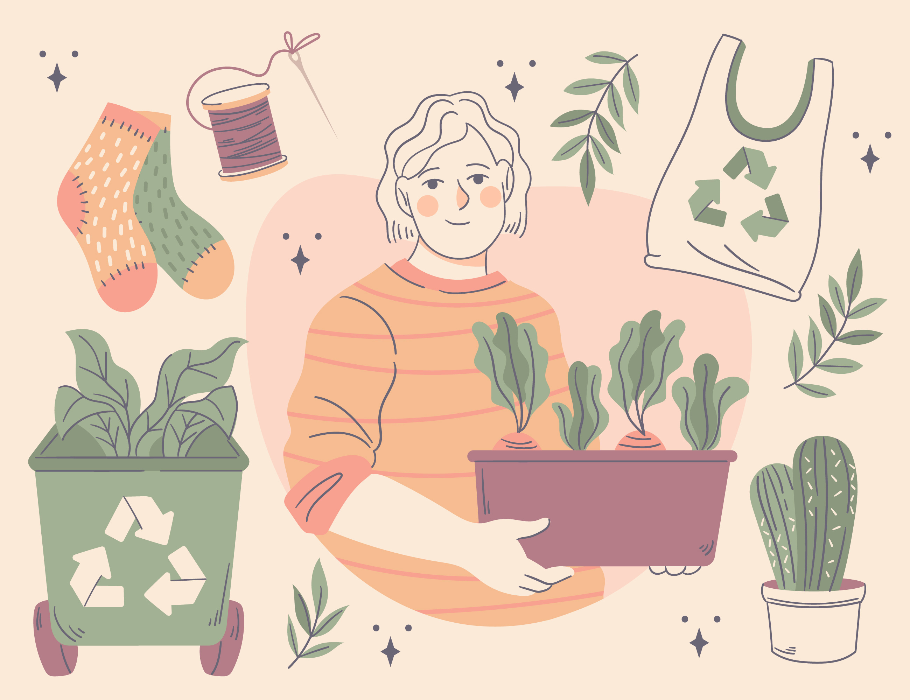

## 8. Ciclo de vida de los productos: análisis y sostenibilidad

El **ciclo de vida de los productos** es una metodología utilizada para evaluar el impacto ambiental de un producto desde su creación hasta su disposición final. Se divide en varias etapas:

| **Fase del Ciclo de Vida**       | **Descripción** |
|----------------------------------|----------------|
| **Extracción de materias primas** | Obtención de recursos naturales (minerales, petróleo, madera, etc.). Impacto en la biodiversidad y contaminación asociada. |
| **Producción y fabricación** | Transformación de las materias primas en productos terminados. Consumo energético, emisión de gases de efecto invernadero y generación de residuos. |
| **Distribución y transporte** | Transporte del producto a los puntos de venta o consumidores. Huella de carbono debido al consumo de combustibles fósiles. |
| **Uso y consumo** |  * Energía y recursos utilizados durante la vida útil del producto.  * Emisiones y residuos generados por su uso. |
| **Fin de vida (reciclaje o disposición final)** | Opciones: reciclaje, reutilización, compostaje o eliminación en vertederos/incineración. Impacto en la contaminación del suelo, aire y agua. |
---

 **Análisis de sostenibilidad en el ciclo de vida.**
La sostenibilidad en el ciclo de vida de los productos busca minimizar los impactos negativos en el medio ambiente y promover prácticas responsables, como:
- **Diseño ecológico:** Uso de materiales reciclados y reducción de componentes contaminantes.
- **Optimización de procesos:** Disminuir el consumo de energía y agua en la producción.
- **Logística sostenible:** Uso de transporte de bajas emisiones y embalajes biodegradables.
- **Promoción de la economía circular:** Fomentar la reutilización, reciclaje y reparación de productos.

El **Análisis del Ciclo de Vida (ACV)** es una herramienta clave para evaluar y mejorar la sostenibilidad de un producto, permitiendo tomar decisiones más responsables a nivel empresarial y de consumo.

**¿Cómo se puede mejorar la sostenibilidad de los productos?**
1. **Diseño sostenible:** Materiales biodegradables y procesos de fabricación eficientes.
2. **Consumo responsable:** Elección de productos con certificaciones ecológicas.
3. **Gestión de residuos:** Separar y reciclar correctamente los productos desechados.
4. **Innovación tecnológica:** Desarrollo de nuevos materiales y energías limpias.

El análisis del ciclo de vida no solo es clave para la sostenibilidad ambiental, sino que también mejora la eficiencia y competitividad de las empresas.

- [8.1 Ciclo de vida de productos tradicionales (hardware): concepto y fases principales (producción, uso, reciclaje).](8.1_ciclo_de_vida_de_productos_tradicionales_jaime.md)
- [8.2 Exploración del ciclo de vida en productos lógicos (software)](8.2_exploracion_ciclo_de_vida_en_productos_logicos_jaime.md)
- [Índice](../indice_pisa3_A_jaime.md)
- [Bibliografía](../md_pisa3_A/bibliografia_pisa3_A_jaime.md)