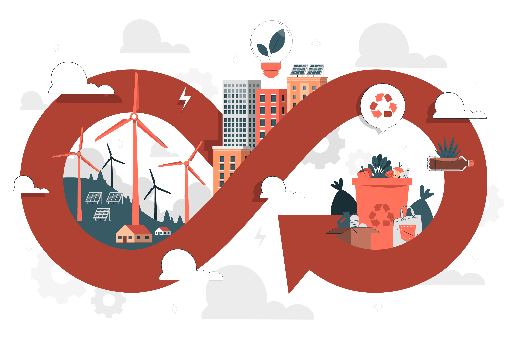

## 9.2 Sostenibilidad en procesos de productos lógicos: optimización energética y reducción de obsolescencia​.

El software, aunque no genera residuos como el hardware, tiene un impacto ambiental significativo debido a su consumo energético y su contribución a la obsolescencia de dispositivos. Para mejorar su sostenibilidad, es clave aplicar estrategias de **optimización energética y reducción de la obsolescencia.**

### 1. Optimización Energética en el Software.

El consumo energético del software proviene principalmente de:

🔹 **Centros de datos y servidores** (almacenamiento en la nube, procesamiento de datos).

🔹 **Consumo de CPU y RAM** en dispositivos de usuario.

🔹 **Ejecución de procesos en segundo plano** que incrementa la demanda de energía.

### Estrategias para la eficiencia energética.

✅ **Código optimizado:** Menos líneas de código y algoritmos eficientes reducen la carga en procesadores.

✅ **Procesamiento eficiente:** Minimizar tareas en segundo plano y evitar el uso innecesario de recursos.

✅ **Arquitecturas escalables:** Uso de computación en la nube con servidores dinámicos para evitar sobrecargas.

✅ **Energía verde en centros de datos:** Empresas como Google y Microsoft utilizan energías renovables para reducir la huella de carbono.

✅ **Software liviano:** Aplicaciones con menor consumo de memoria y almacenamiento.

💡 *Ejemplo*: Google Chrome y Firefox han implementado funciones para reducir el uso de RAM y batería en dispositivos.

### 2. Reducción de la Obsolescencia en Software.
   
La obsolescencia en productos lógicos se da cuando:

🔹 **Las actualizaciones vuelven inservibles dispositivos más antiguos.**

🔹 **El software deja de recibir soporte y seguridad, forzando su reemplazo.**

🔹 **Formatos y compatibilidades cambian rápidamente, dificultando la interoperabilidad.**

### Estrategias para reducir la obsolescencia digital.

✅ **Compatibilidad a largo plazo:** Mantener soporte para hardware y sistemas operativos antiguos.

✅ **Software de código abierto:** Facilita actualizaciones y reparaciones sin depender de una sola empresa.

✅ **Actualizaciones sostenibles:** Mejorar funcionalidades sin aumentar excesivamente los requisitos de hardware.

✅ **Modularidad:** Permitir la actualización por partes en lugar de forzar reemplazos completos.

💡 *Ejemplo*: Linux mantiene soporte para hardware antiguo, permitiendo que equipos más viejos sigan en uso sin problemas.

### Conclusión
La sostenibilidad en productos lógicos requiere **optimización energética** para reducir el consumo de recursos y **estrategias contra la obsolescencia** para prolongar la vida útil del software y del hardware asociado. Adoptar estas prácticas ayuda a reducir la huella digital y avanzar hacia una tecnología más ecológica. 🌍💻♻️

- [Volver al capítulo 9 (inicio del documento)](9_Procesos_de_produccion_jaime.md)
- [9.1 Sostenibilidad en procesos de productos físicos: diseño, materiales y uso eficiente de recursos.](9.1_Sostenibilidad_en_procesos_de_productos_fisicos_jaime.md)
- [Índice](../indice_pisa3_A_jaime.md)
- [Bibliografía](../md_pisa3_A/bibliografia_pisa3_A_jaime.md)